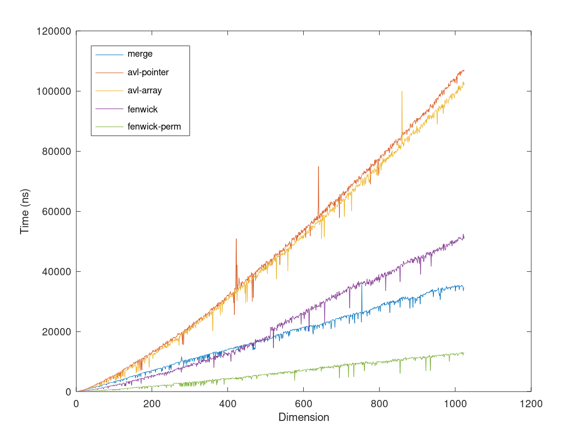
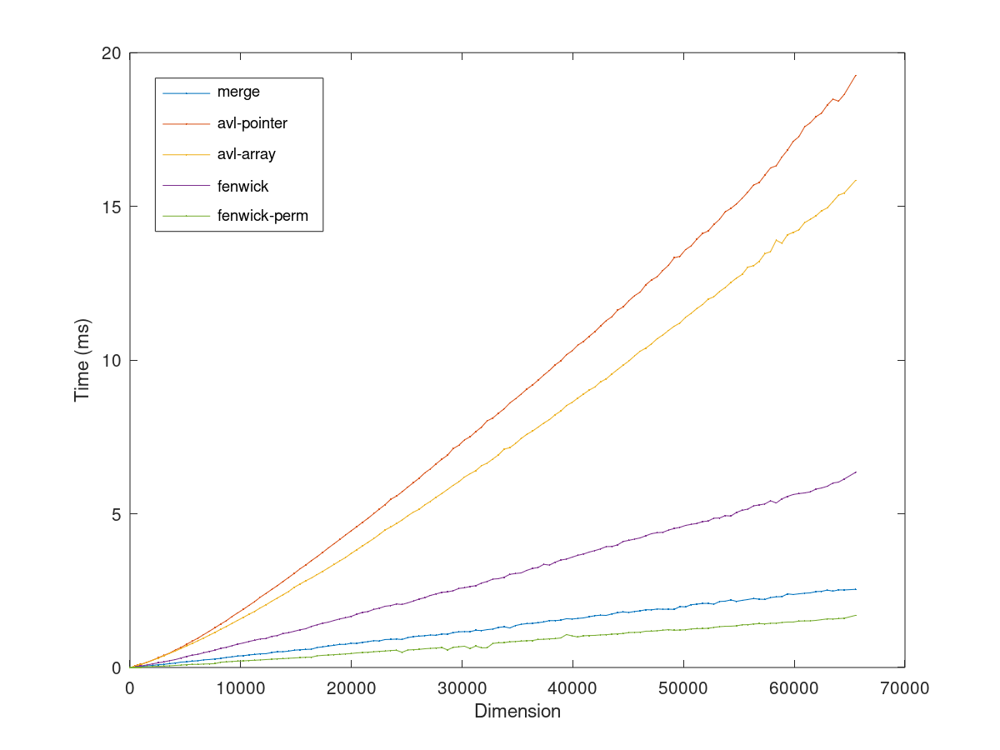
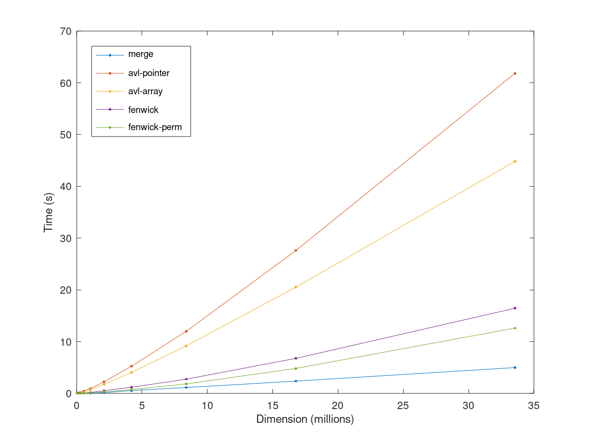

# Inversions Count Benchmark

We propose five approaches and solutions to this problem and benchmark them using [Google Benchmark](https://github.com/google/benchmark):

1. Using Merge sort
2. Using Binary balanced trees (AVL trees implemented with pointers)
3. Using Binary balanced trees (AVL trees implemented with `std::vector`)
4. Using Fenwick trees (`std::vector` implementation, using `std::sort` to remap)
5. Using Fenwick trees (`std::vector` implementation, assuming the input is a permutation)

The first approach is a standard solution to this problem. Comparing the two Binary balanced trees implementations allows us to compare how the use of pointers and frequent memory allocations can affect cache efficiency and thus degrade performance. Finally, the use of Fenwick trees allows us to test and benchmark a completely different approach which uses an underlying vector with no concrete tree being constructed (similarly as heaps).

The Fenwick tree solution has also been tested on randomly generated permutations in order to verify how much the sorting and remapping overhead can affect the overall performance. The first solution remaps the input to a permutation using the `std::sort` function available from the STL, while the second assumes it is already a permutation.

## Methodological notes

All tests have been verified by randomly generating data and testing all the solutions on the same datasets, with progressively increasing input dimension. We tested the solutions on the following intervals:

1. [(1)](https://github.com/iwilare/CompetitiveProgramming/tree/master/Report%201#1-size-1-1024-linear-increase-by-1) Linear increase by 1 up to 1024
2. [(2)](https://github.com/iwilare/CompetitiveProgramming/tree/master/Report%201#2-size-1-65536-linear-increase-by-512) Linear increase by 512 up to 65536
3. [(3)](https://github.com/iwilare/CompetitiveProgramming/tree/master/Report%201#3-size-from-65536-exponential-increase-by-2-up-to-33554432-225) Exponential increase by factors of 2 up to 33,554,432 (2^25)
4. [(4)](https://github.com/iwilare/CompetitiveProgramming/tree/master/Report%201#4-overtake-of-merge-over-fenwick-perm-linear-increase-by-1024) Linear increase by 1024 up to 1,048,576 (2^20)

The input dimension is linear until size 1024 to check for early overheads, then increases in blocks of 512 until size 65536 in order to interpolate a starting complexity representation; we then used increases of 1024 to concentrate on the behaviour of the Fenwick approaches compared to the merge one, and finally we tested all solutions by exponentially increasing array size using powers of two.

Multiple iterations of each test are automatically performed by [Google Benchmark](https://github.com/google/benchmark) and then averaged together in order to smooth down the systematic error.

All tested code is available on this repository and all solutions have been tested on the [SPOJ page of the problem](https://www.spoj.com/problems/INVCNT/).

# Results

## 1. Size 1-1024, linear increase by 1



## 2. Size 1-65536, linear increase by 512



## 3. Size from 65536, exponential increase by 2 up to 33,554,432 (2^25)



## 4. Overtake of `merge` over `fenwick-perm`, linear increase by 1024


# Conclusions

- `avl-pointer` and `avl-array` are surprisingly comparable for small values. The difference between the two solutions however increases as the dimension increases, thus `avl-array` having the upper hand.
- Until dimension ~512, shown in interval [(1)](https://github.com/iwilare/CompetitiveProgramming/tree/master/Report%201#1-size-1-1024-linear-increase-by-1), the `fenwick` with remapping approach is faster than `merge`, after which the two abruptly exchange, with a somewhat visible change in the way `fenwick` increases.
- This phenomenon might be due to the fact that `fenwick` uses `std::sort`, which is well optimized compared to a naive implementation of Merge Sort, but might behave differently for other dimensions. Both solutions effectively implement a sorting operation, but the overhead of having to later create the Fenwick tree after sorting probably puts the `fenwick` with remapping approach at further disadvantage compared to the `merge` one.
- For the entire second interval [(2)](https://github.com/iwilare/CompetitiveProgramming/tree/master/Report%201#2-size-1-65536-linear-increase-by-512) until 65536 the situation remains stable overall.
- However, in the exponential and biggest interval [(3)](https://github.com/iwilare/CompetitiveProgramming/tree/master/Report%201#3-size-from-65536-exponential-increase-by-2-up-to-33554432-225), the fastest solution clearly comes out to be `merge` again, which manages to be faster even than `fenwick-perm` (which doesn't use `std::sort` and assumes that the input is already a "remapped" permutation).
- As shown in the last diagram [(4)](https://github.com/iwilare/CompetitiveProgramming/tree/master/Report%201#4-overtake-of-merge-over-fenwick-perm-linear-increase-by-1024), the overtake of the two solutions seems to be at around ~500k elements, with the `merge` solution remaining stable even as dimension increases. Even after repeating this interval with particularly great dimensions, the output remains consistent with `merge` being in advantage. Observe the distinctive ways the two `fenwick` approaches increase when compared with the `merge` one.

# Specs

Compiled with `g++ -O3`, gcc version 8.3.0 (Debian 8.3.0-6), [Google Benchmark](https://github.com/google/benchmark) 1.5.2, tested on a Intel(R) Core(TM) i7-7500U CPU @ 2.70 GHz / 2.90 GHz, 4 cores using WSL2.
Cache and CPU info reported by [Google Benchmark](https://github.com/google/benchmark):
```
Run on (4 X 2904 MHz CPU s)
CPU Caches:
  L1 Data 32 KiB (x2)
  L1 Instruction 32 KiB (x2)
  L2 Unified 256 KiB (x2)
  L3 Unified 4096 KiB (x1)
```
